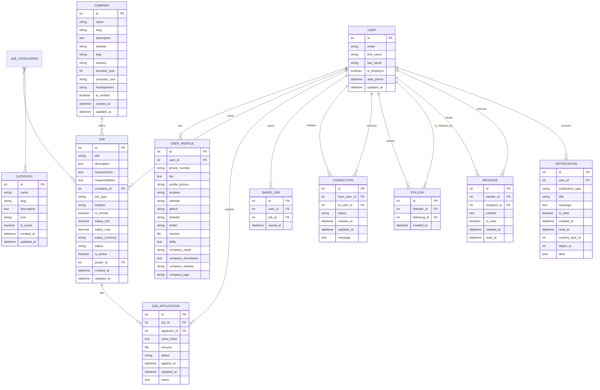

# CareerOpen - Database Design Documentation

## Table of Contents
1. [Entity Relationship Diagram (ERD)](#entity-relationship-diagram-erd)
2. [Database Schema](#database-schema)
   - [Users & Authentication](#users--authentication)
   - [Companies](#companies)
   - [Jobs](#jobs)
   - [Applications](#applications)
   - [Networking](#networking)
   - [Messaging](#messaging)
   - [Notifications](#notifications)
3. [Relationships](#relationships)
4. [Indexes & Performance](#indexes--performance)
5. [Data Validation](#data-validation)

## Entity Relationship Diagram (ERD)



## Database Schema

### Users & Authentication
- **User**: Core authentication model with email/password auth
- **UserProfile**: Extended user information (both job seekers and employers)

### Companies
- **Company**: Organization details with verification status
- **Category**: Job categories for classification

### Jobs
- **Job**: Job postings with detailed requirements and salary information
- **JobApplication**: Applications submitted by users
- **SavedJob**: Jobs saved by users for later review

### Networking
- **Connection**: User connections with status tracking
- **Follow**: One-way following between users

### Messaging
- **Message**: Direct messages between connected users

### Notifications
- **Notification**: System notifications for various events

## Relationships

1. **User to UserProfile**: One-to-One
   - A user has exactly one profile
   - A profile belongs to exactly one user

2. **User to Job**: One-to-Many
   - A user (employer) can post multiple jobs
   - Each job is posted by one user

3. **Company to Job**: One-to-Many
   - A company can have multiple job postings
   - Each job belongs to one company

4. **Job to Category**: Many-to-Many
   - A job can be in multiple categories
   - A category can contain multiple jobs

5. **User to JobApplication**: One-to-Many
   - A user can submit multiple job applications
   - Each application is submitted by one user

6. **User to Connection**: Self-referential Many-to-Many
   - A user can have multiple connections
   - Connections can be in various states (pending, accepted, etc.)

## Indexes & Performance

### Primary Indexes
- All models have an auto-incrementing primary key
- User: email (unique)
- Company: name, slug (unique)
- Job: company_id, poster_id, status, is_active
- JobApplication: job_id, applicant_id, status
- Connection: from_user_id, to_user_id, status
- Message: sender_id, recipient_id, created_at
- Notification: user_id, is_read, created_at

### Performance Considerations
1. Added indexes on all foreign keys
2. Composite indexes for common query patterns
3. Pagination implemented for list views
4. Select-related and prefetch-related used to minimize database queries

## Data Validation

### User Input Validation
- Email format validation
- Password strength requirements
- File type and size restrictions for uploads
- HTML sanitization for user-generated content

### Business Logic Validation
- Only employers can post jobs
- Users can only apply to active job postings
- Messages only allowed between connected users
- Job applications can only be in valid statuses

## Security Considerations

1. **Authentication**:
   - Password hashing with PBKDF2
   - JWT token-based authentication
   - Password reset flow with secure tokens

2. **Authorization**:
   - Role-based access control (RBAC)
   - Object-level permissions for sensitive operations
   - Rate limiting for authentication endpoints

3. **Data Protection**:
   - Sensitive fields encrypted at rest
   - Secure file upload handling
   - CSRF protection on all forms

## Deployment Notes

### Database Requirements
- PostgreSQL 12+
- Required extensions: pg_trgm (for text search)
- Recommended configuration for production:
  ```
  shared_buffers = 1GB
  work_mem = 16MB
  maintenance_work_mem = 256MB
  effective_cache_size = 3GB
  ```

### Migration Strategy
1. Run migrations in a transaction
2. Back up database before migrations
3. Test migrations in staging environment
4. Use zero-downtime deployment for critical updates

## Changelog

### 2025-08-10
- Initial database schema design
- Added ERD and documentation
- Defined relationships and constraints
